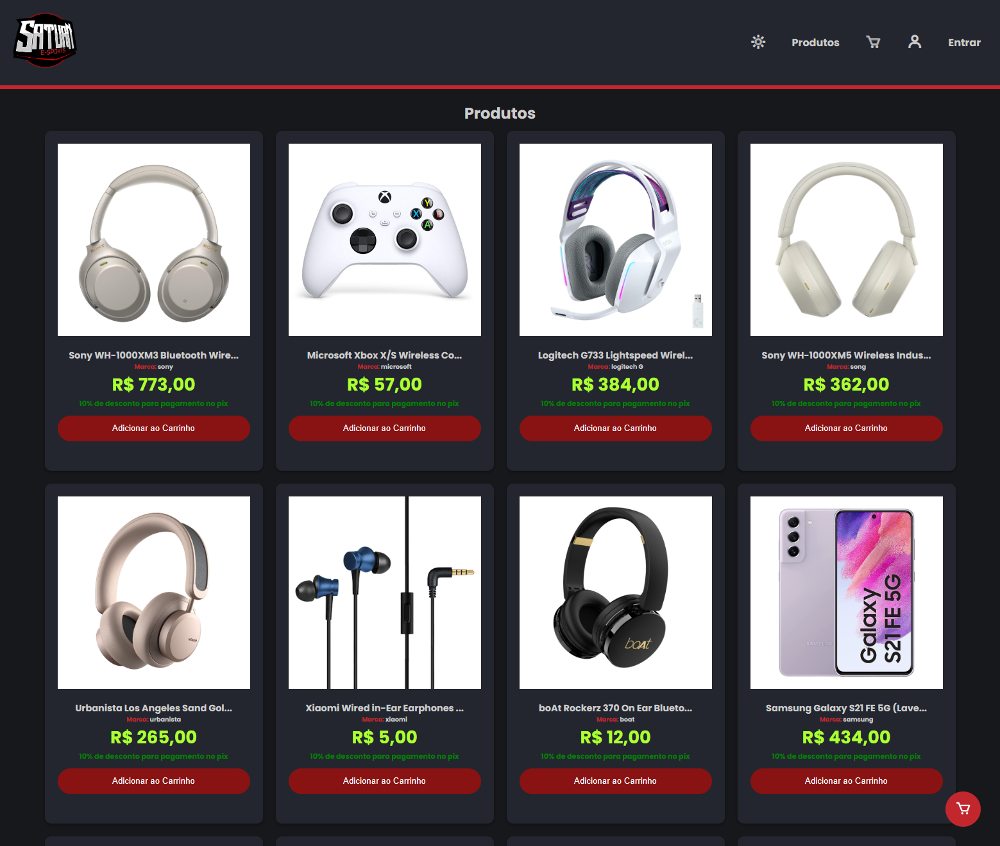

## loja virtual fake com consumo de API

- Projeto de Estudo Feito Com a Api de [loja Fake](https://fakestoreapi.in)

- Logo do Projeto Feita por mim com Adobe Illustrator

# Funcionalidades

- Projeto totalmente funcional(até o momento ainda em construção), já tem os requisitos de carrinho, pagina de detalhes do produto(escolha um produto clicando na imagem dele).
- paginação dos produtos em 6 páginas com no máximo 28 produtos.

# Temas Claro e Escuro

# Responsividade

# Carrinho de Compras

# Página Detalhes do Produto

